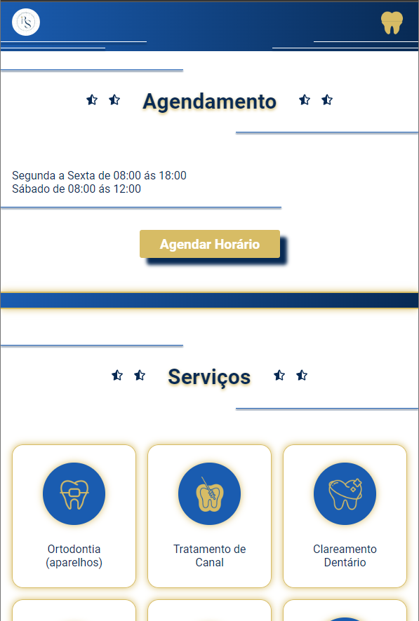
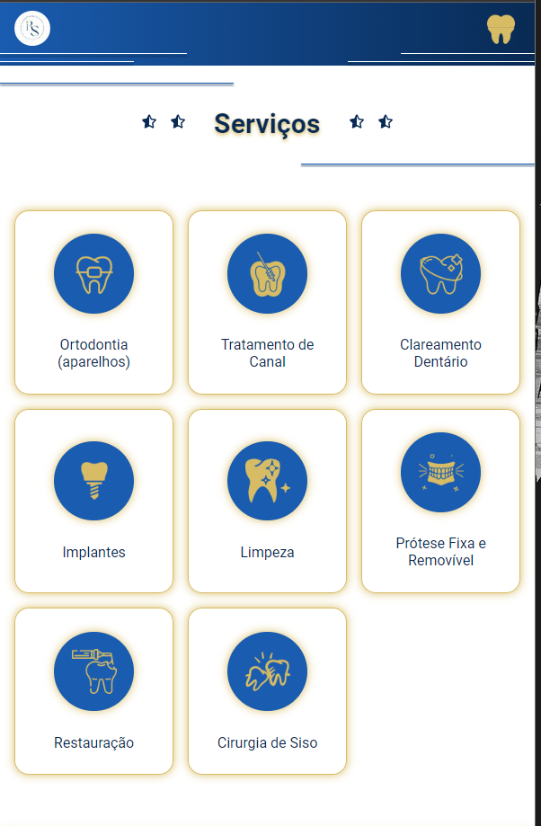
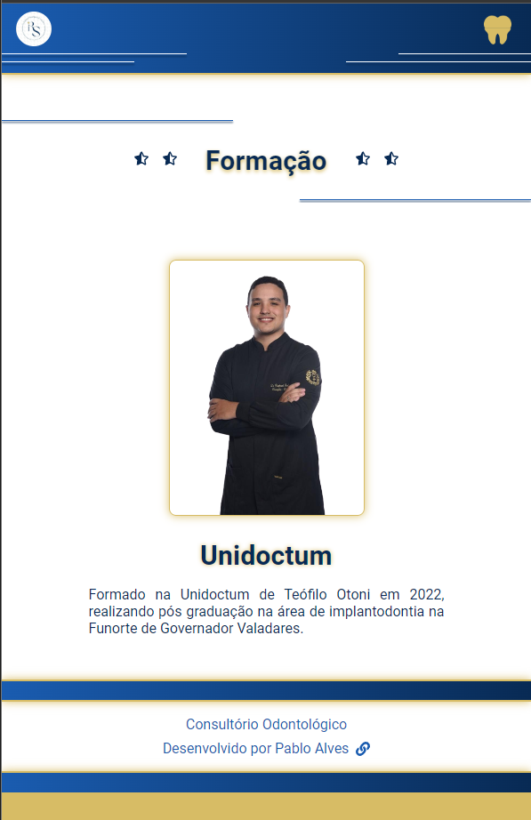
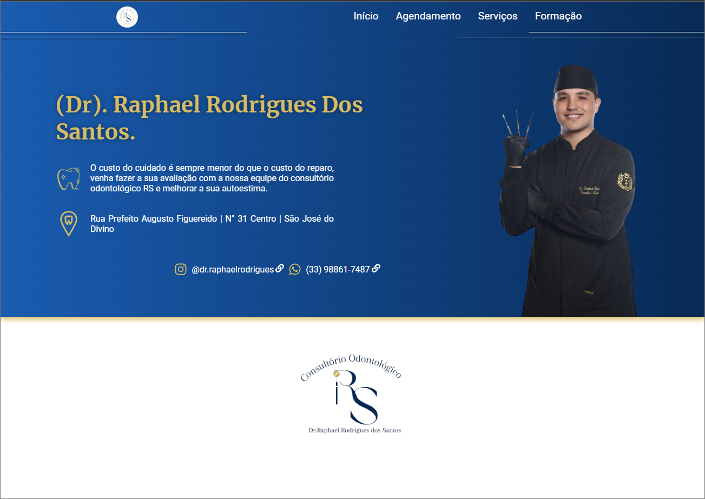
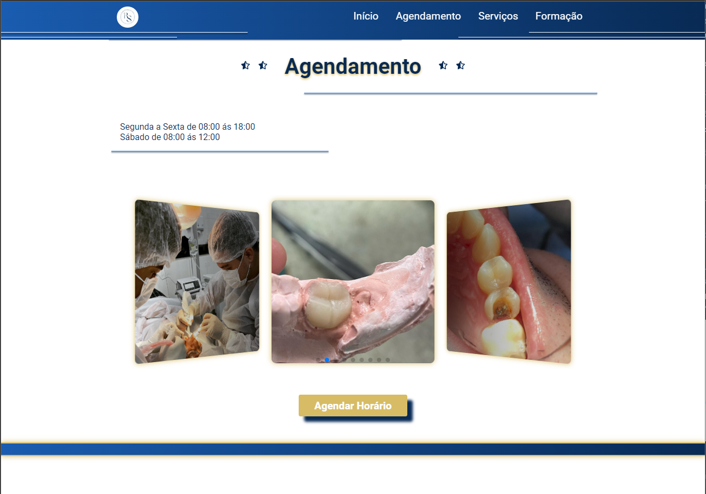
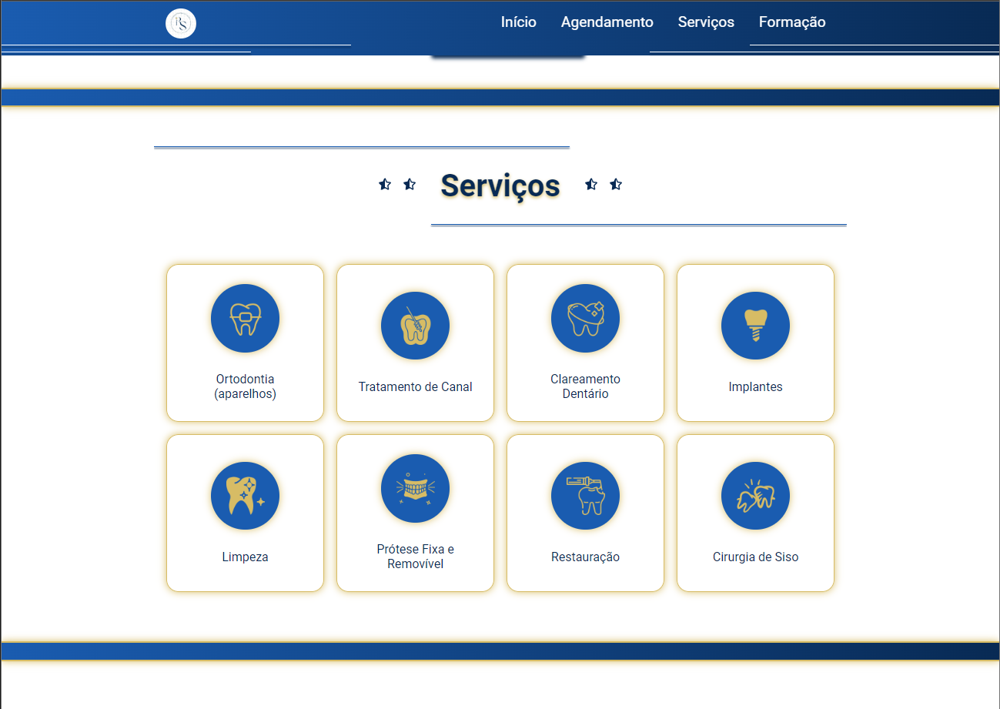
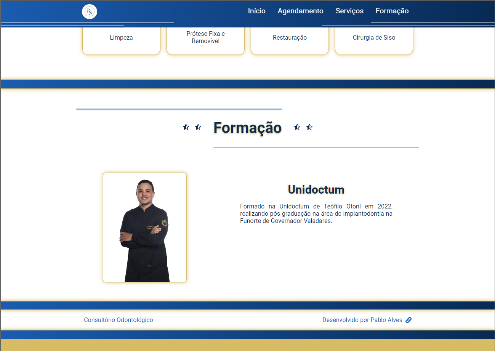

## Responsividade mobile

  
  
  
  
  

## Descktop

  
  
  
  

## Sobre 

Landing page criada com React Js e Sass, utilizei swiper para fazer o carousel.
Criei o layout no figma e em seguida desenvolvi com React, foi um trabalho voluntário o cliente gostou bastante !!

<a href="https://consultoriors.netlify.app/"> Ver Projeto </a>

